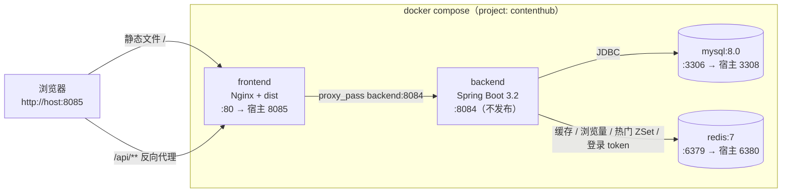

# ContentHub · 数字内容订阅与创作者平台

> 创作者发布数字内容 → 用户订阅 → 根据订阅获得内容权限 → 阅读/观看/下载 → 产生互动。
>
> 开发路线、阶段划分与技术选型一律以根目录 `ContentHub_开发指导计划.docx` 为准，本 README 只做两件事：说明启动方式，记录与计划对齐的当前进度。

## 项目定位

ContentHub 不是一个普通"卖电子书"的商城，而是一个"创作者发布数字内容 → 用户订阅 → 根据订阅获得内容权限 → 阅读/观看/下载 → 产生互动"的小型内容平台。

真正要练的不是 CRUD，而是完整业务链：用户是谁、内容是谁发布的、订阅了什么、订阅后能看什么、哪些内容免费、哪些内容需要权限、热门内容怎么统计，以及这些数据怎样落到 MySQL 和 Redis。

支持内容形态：技术文章 / 系列教程 / 电子书 / 视频课程 / PDF / 数据集。

## 业务主线（计划 §6）

| 业务 | 流程 |
|---|---|
| 注册登录 | 注册 → 密码加密保存 → 登录 → JWT → Redis 保存 token → 前端保存登录状态 |
| 发布内容 | 创作者登录 → 填写内容 → 保存草稿 → 发布 → 管理员审核 → 上线 |
| 订阅 | 用户查看套餐 → 选择套餐 → 模拟支付 → 创建订阅 → 计算到期时间 → 获得访问权限 |
| 访问内容 | 请求内容 → 判断免费/付费 → 判断用户是否有有效订阅 → 有权限才返回正文/下载地址 |

## 技术栈（计划 §3 表 2）

| 部分 | 计划技术 | 当前状态 |
|---|---|---|
| 前端 | Vue 3 + TypeScript + Vite | ✅ Vue 3 + **TypeScript 5.9** + Vite 4，`vue-tsc` 类型检查已接入构建 |
| 前端状态 | Pinia + Axios + Element Plus | ✅ 已就绪，Pinia 持久化插件已注册 |
| 后端 | Java 17 + Spring Boot 3 | ✅ **Java 17 + Spring Boot 3.2.5** |
| 数据库 | MySQL + MyBatis-Plus | ✅ 已就绪（`contenthub` 库 @3308，MyBatis-Plus 3.5.5） |
| 权限 | Spring Security + JWT | ✅ JWT + Redis 会话、USER / CREATOR / ADMIN 三级角色鉴权 |
| 缓存 | Redis | ✅ 已接入（127.0.0.1:6380，token / 内容缓存 / 浏览计数 / 热门榜） |
| 部署 | Docker + Nginx | ✅ 多阶段镜像 + Nginx 反代，`docker compose --profile full` 一键起 |

## 目录结构

```text
ContentHub/
├── backend/                     # Spring Boot 多模块后端
│   ├── contenthub-common/       # DO / Mapper / 枚举 / 异常 / 工具类
│   ├── contenthub-jwt/          # JWT 认证模块：登录过滤器 / Token
│   ├── contenthub-admin/        # 管理端配置：Security 配置
│   └── contenthub-web/          # Web 启动模块：Controller / Service + 配置
├── frontend/                    # Vue3 + TypeScript + Vite 前端
│   └── src/
│       ├── api/                 # 接口封装与共享类型（auth / content / category / creator / plan / subscription / skill / types）
│       ├── stores/user.ts       # Pinia 登录态
│       ├── router/index.ts      # 路由与守卫（requiresAuth / roles）
│       └── views/
│           ├── Home.vue / ContentList.vue / ContentDetail.vue   # 首页（含热门榜）/ 内容库（栏目横排）/ 详情（试读 + 评论 + 收藏）
│           ├── Login.vue / Register.vue / Profile.vue           # 认证与个人中心（收藏 / 阅读历史 / 我的评论）
│           ├── skill/           # Skill 商城：SkillList.vue（分类 + 星数排序）、SkillDetail.vue
│           ├── creator/         # 工作台（统计 + 状态流转）、创作者资料、套餐管理、发布与编辑
│           ├── admin/           # 内容审核、评论管理、用户管理、内容分类、套餐管理、Skill 商城管理（List + Edit）
│           └── subscription/    # 订阅方案、我的订阅
├── docs/
│   └── database.sql             # 数据库建表脚本 + 演示数据（同时作为 MySQL 容器初始化脚本）
├── scripts/                     # 本地开发启停脚本
│   ├── _common.ps1              # 公共函数（原生命令调用、端口探测、等待）
│   ├── dev-up.ps1               # 拉起容器 + 后端 + 前端
│   ├── dev-down.ps1             # 停止后端 / 前端
│   ├── dev-status.ps1           # 状态总览
│   └── register-autostart.ps1   # 注册 / 卸载登录自启任务
├── docker-compose.yml           # ContentHub 专属 MySQL(3308) + Redis(6380)
├── ContentHub_开发指导计划.docx  # 开发路线的唯一依据
└── README.md
```

## 当前进度（按计划 §10 表 9 的阶段口径）

| 阶段 | 天数 | 主要成果 | 状态 |
|---|---|---|---|
| 阶段 0 | Day 1-4 | 环境、Git、项目骨架、数据库连接 | ✅ 已完成 |
| 阶段 1 | Day 5-12 | Vue3 基础 + 用户/分类/内容基础 CRUD | ✅ 已完成（tag `v0.1`） |
| 阶段 2 | Day 13-19 | Spring Security + JWT + Redis 登录权限 | ✅ 已完成 |
| 阶段 3 | Day 20-29 | 内容中心：发布、详情、审核、权限访问 | ✅ 已完成（tag `v0.2`） |
| 阶段 4 | Day 30-38 | 套餐、订阅、模拟支付、订阅到期 | ✅ 已完成（tag `v0.2`） |
| 阶段 5 | Day 39-47 | Redis 缓存、热门、搜索、收藏、评论、历史 | ✅ 已完成 |
| 阶段 6 | Day 48-55 | 创作者中心 + 管理后台 | ✅ 已完成 |
| 阶段 7 | Day 56-60 | 联调、异常处理、Docker、Nginx、部署 | ✅ 已完成（tag `v1.0`） |
| 可选升级 | Day 61-70 | Spring AI / RAG / AI 内容助手 | ⬜ 未开始 |

**结论：计划的 60 天主体（阶段 0-7）已全部完成，仅剩可选的 AI 升级阶段。**

### 阶段 7 已完成

| 计划验收标准 | 落实 |
|---|---|
| 一个命令可以启动主要服务 | `docker compose --profile full up -d --build` |
| 公网可以访问前端 | Nginx 容器唯一对外端口（默认 8085），静态产物 + `/api` 反代 |
| 登录、浏览、订阅、权限、后台流程完整可跑 | 经 Nginx 走通，见下方「部署验证」 |
| README 写清楚启动方式和项目亮点 | 「部署」与「项目亮点」两节 |

- **异常处理补齐（Day 56）**：新增对参数绑定失败、参数类型不匹配、请求体非法 JSON、缺少必填参数、请求方法不支持、路径不存在、唯一键冲突的处理。此前这些都会落到「其他异常」分支返回笼统的系统错误，`GET /contents/abc` 这类请求甚至只能看到一句「出错啦」。
- **返回约定**：应用层异常统一返回 HTTP 200 + 统一响应体（`success=false` + 错误码），只有 Spring Security 的认证/授权失败返回 401/403。前端因此只需一套解析逻辑：先看状态码判断登录态，再看 `success` 判断业务结果。未预期异常的堆栈只进日志，不会把表名、SQL、类名泄漏给调用方。
- **前后端容器化（Day 57）**：后端多阶段构建（Maven 构建 → JRE 运行，运行镜像里没有源码和 Maven 仓库，并以非 root 用户启动）；前端多阶段构建（Node 构建 → Nginx 托管产物）。
- **Nginx 反向代理（Day 58）**：`location ^~ /api/` 用 `^~` 前缀匹配，避免 `/api/xxx.js` 被静态资源正则抢走；开启 gzip（打包后单个 JS 接近 1MB）；静态资源 7 天缓存。
- **两侧镜像加速**：后端在容器内构建时 Maven 依赖走 pom 里声明的阿里云仓库；前端加了项目级 `.npmrc` 指向 npmmirror，否则容器构建会去打 registry.npmjs.org 而频繁超时。

### 阶段 5 与阶段 6 已完成

| 阶段 | 计划验收标准 | 落实 |
|---|---|---|
| 5 | 热门内容排序明显可见 | `GET /api/contents/hot` 读 Redis ZSet 排名，按热度分倒序 |
| 5 | 重复访问热点详情能命中缓存 | 详情先查 `content:{id}`，命中则不打库；TTL 30 分钟 |
| 5 | 浏览量会增长 | 访问即 `INCR content:view:{id}`，接口返回值已叠加待同步增量 |
| 5 | 个人中心能看到收藏、评论、历史 | 个人中心含收藏、阅读历史（带进度条）、我的评论三块 |
| 6 | 不同角色看到不同菜单 | 顶栏按角色渲染：创作者见工作台，管理员另见「管理后台」下拉 |
| 6 | 创作者可以独立运营自己的内容 | 工作台统计 + 状态流转 + 资料 + 套餐管理 |
| 6 | 管理员可以处理平台日常事务 | 内容审核、评论管理、用户管理、分类管理、套餐管理 |
| 6 | 能讲清楚 RBAC 的基本实现 | 见下方「权限模型」 |

主要实现要点：

**Redis 的四处用法（对应计划表 8）**

| 场景 | Key | 用法 |
|---|---|---|
| 登录 token | `login:token:{token}` | 阶段 2 已实现 |
| 内容缓存 | `content:{id}` | 缓存 `ContentDO` 的 JSON，TTL 30 分钟 |
| 浏览量 | `content:view:{id}` | `INCR` 累计，定时任务 `getAndDelete` 后累加进 MySQL |
| 热门内容 | `hot:content` | ZSet，浏览 +1、收藏 +3、取消收藏 -3（下限 0） |

- **缓存的是 DO 而不是组装好的 VO**：详情 VO 里带 `locked` 与 `favorited`，是随访问者变化的；缓存它会把 A 用户的解锁状态泄漏给 B 用户。缓存「与访问者无关」的那一层才是安全的。
- **缓存失效覆盖所有写路径**：编辑、删除、状态流转、浏览量落库都会 `evict`，这正是计划 Day 40 要解决的「改了数据库但缓存还是旧数据」。
- **浏览量先写 Redis 再定时落库**：浏览量是高频写、允许最终一致的数据，每次打库会造成热点行写竞争。定时任务用 `getAndDelete` 取值，避免「取完没落库就崩溃」导致重复累加。
- **热门榜冷启动用库里的历史 `view_count` 打底**：否则服务刚启动时热门榜是空的，看起来像功能坏了。
- **接口返回的浏览量 = 库里的值 + Redis 待同步增量**，所以刚访问完刷新就能看到增长，而不是等 30 秒。

**权限模型（RBAC）**

- 角色来自 `users.role`，在 `UserDetailServiceImpl` 里映射为 `ROLE_USER` / `ROLE_CREATOR` / `ROLE_ADMIN` 放进 `LoginUser`。
- `WebSecurityConfig` 按「读公开、写按角色」编排，**规则自上而下先匹配先生效**：`/contents/mine` 与 `/contents/*/favorite` 这类规则必须写在 `GET /contents/**` 与 `DELETE /contents/**` 之前，否则会被后者放行或拦掉。
- 角色只回答「这类操作能不能做」，「这条数据是不是你的」由 Service 层的归属校验回答（`NOT_CONTENT_OWNER` / `NOT_COMMENT_OWNER`）。两者缺一不可：只做角色校验，任何创作者都能改别人的内容。
- 前端路由守卫只是体验层，改 localStorage 就能绕过，真正的权限始终在后端。

**账号禁用（阶段 6 Day 51）**

`users` 增加 `status` 字段。禁用不是直接抛异常，而是让 `LoginUser.isEnabled()` 返回 false，由 `DaoAuthenticationProvider` 抛出 `DisabledException`——这样「用户名不存在」与「账号被禁用」在响应上仍然可区分（错误码 `20019`）。另外禁止管理员禁用自己，避免把自己锁在门外。

### 阶段 3 与阶段 4 已完成

计划这两阶段的验收标准与落实方式：

| 阶段 | 计划验收标准 | 落实 |
|---|---|---|
| 3 | 创作者能发布内容 | `POST /api/contents` 落库为 DRAFT，`POST /api/contents/{id}/submit` 提交审核 |
| 3 | 管理员能审核内容 | `POST /api/admin/contents/{id}/approve` / `reject`，配套审核页 |
| 3 | 普通用户能浏览免费内容 | 免费内容对游客直接返回完整正文 |
| 3 | 付费内容没有权限时只能看到预览信息 | `locked=true`、`body=null`、`fileUrl=null`，只给 `bodyPreview` |
| 3 | 有订阅权限的用户能看到完整内容/访问地址 | 订阅生效后 `body` 与 `fileUrl` 一并返回 |
| 4 | 能创建 Pro / Premium 套餐 | 种子里已含两个套餐，创作者也可在套餐管理页自助创建 |
| 4 | 用户点击订阅后能模拟支付成功 | `POST /api/subscriptions/{planId}/pay/mock` |
| 4 | 支付后生成订阅记录 | 事务内创建，`start/end` 按套餐 `duration_days` 计算 |
| 4 | 订阅未过期时可以看付费内容 | 鉴权按 `status=ACTIVE 且 end_time > now` 判定 |
| 4 | 订阅过期后重新变成无权限 | 到期即失权，不依赖定时任务翻转状态 |

主要实现要点：

- **内容状态机（Day 21）**：允许的流转写成一张表（`DRAFT/REJECTED/OFFLINE → PENDING → PUBLISHED/REJECTED`，`PUBLISHED → OFFLINE`），所有流转走同一个 `transition()` 入口。**引入审核后创作者不能再自发布**——`POST /contents` 强制 DRAFT，编辑接口显式拒绝 `PUBLISHED`，否则「审核」形同虚设。
- **驳回原因**：`contents` 新增 `reject_reason`。注意 `updateById` 会忽略 null 字段，所以「清空驳回原因」必须走原生 `UPDATE`，否则重新提交后还会残留上一次的驳回理由。
- **访问权限收敛在一处**：`ContentAccessService.decide()`，判定顺序为 免费 → 作者本人/管理员 → 有效订阅 → 否则只给试读。各 Controller 不再散落 if。
- **订阅（Day 32-36）**：`subscriptions` 上冗余了 `creator_id`，鉴权时不必 join 套餐表；有效期按 `end_time > now` 实时判断，**过期立刻失权，不依赖定时任务**（定时任务漏跑或服务停一段时间都不会把过期订阅误判为有效）。对同一创作者的重复购买走**续期**（从原到期时间顺延，而不是从今天重算），因此不会产生两条并行订阅。
- **创作者身份（Day 20）**：新增 `POST /api/creator/apply`，把 `users.role` 从 USER 升为 CREATOR 并建立 `creator_profiles`。没有这条路径的话，注册用户没有任何办法获得发布权限。

### 两个顺手修掉的真实缺陷

1. **逻辑删除 + 唯一索引互相冲突**（阶段 1 埋下、阶段 3 发现）：
   - `favorites` 有 `uk_user_content`，而逻辑删除只是把 `is_deleted` 置 1、行仍占着唯一键 —— 「取消收藏 → 重新收藏」会在 INSERT 时撞唯一键报 500。收藏是轻量关系记录，改为**物理删除**。
   - `content_category` 有 `uk_name`，同类问题：删掉一个分类后用同名再建会撞唯一键。改为建分类前先用原生 SQL 查「含已删除」的记录，命中已删除的就**复活**它。
   - 通用教训：**只要表上有唯一索引，就不该对参与该索引的字段用逻辑删除**。
2. **`remainingDays` 少一天**：原先用 `Duration.between(now, endTime).toDays()`，刚买 7 天套餐时因毫秒差返回 6，界面显示「剩余 6 天」。改为按日期差（`ChronoUnit.DAYS.between(localDate, localDate)`）计算。

### 阶段 1 与阶段 2 已完成

计划这两阶段的验收标准与落实方式：

| 阶段 | 计划验收标准 | 落实 |
|---|---|---|
| 1 | 可以新增分类 | `POST /api/categories`（仅管理员），含重名与「分类下有内容不可删」校验 |
| 1 | 可以新增/编辑/删除/分页查询内容 | `POST` / `PUT` / `DELETE /api/contents`，`GET /api/contents/page` 真分页（`PaginationInnerInterceptor`） |
| 1 | 前端能看到内容列表和详情 | 首页、内容库（筛选+分页）、内容详情、创作者工作台、发布/编辑页、分类管理页 |
| 1 | 分类 → 内容 → 详情跑通 | 已端到端验证 |
| 2 | 未登录不能访问个人中心 | `GET /api/users/me` 需登录，实测 401 |
| 2 | 普通用户不能访问创作者后台 | `GET /api/contents/mine` 需 CREATOR/ADMIN，实测 USER 403 |
| 2 | 管理员可以进入管理页面 | `GET /api/categories/all` 需 ADMIN，实测 CREATOR 403 / ADMIN 200 |
| 2 | Redis 可查到 token 并能测试过期 | `login:token:{token}`，值=用户名，TTL 实测 86400 秒（1440 分钟） |

主要实现要点：

- **Redis 存 token（Day 16）**：登录成功写入 `login:token:{token}`（计划表 8 的 Key 命名），TTL 与 JWT 过期时间共用 `jwt.tokenExpireTime`；`TokenAuthenticationFilter` 在验签之后**再查一次 Redis**，因此退出登录能让 token 立即失效——纯 JWT 是签发即不可撤回的。
- **真实角色（Day 17）**：新增 `LoginUser implements UserDetails`，携带 `userId` 与 `role`。改造前 `UserDetailServiceImpl` 把 authorities 写死成 `ADMIN`，等于任何登录用户都是管理员；现在从 `users.role` 读取并映射为 `ROLE_*`。
- **角色授权**：`WebSecurityConfig` 按「读公开、写按角色」编排，先匹配先生效。`RestAccessDeniedHandler` 原先只打日志、不写响应体（注释里写着「预留，后面引入多角色时会用到」），现在返回 403 + 业务错误码，前端才能区分「没登录」与「登录了但权限不够」。
- **移除废弃 API**：`JwtAuthenticationSecurityConfig` 不再继承 `SecurityConfigurerAdapter` / 使用 `http.apply()`，改为显式暴露 `DaoAuthenticationProvider` 与 `JwtAuthenticationFilter` Bean，编译告警消失。
- **统一 API 前缀**：`server.servlet.context-path: /api`，与计划表 19 的接口约定一致。**因此 API 文档地址变为 `http://127.0.0.1:8084/api/doc.html`（仅 `dev` profile 可用；容器环境关掉了 springdoc，并在 Nginx 上把 `doc.html` 直接挡成 404）。**
- **VO/DTO 分层**：接口不再直接返回 `ContentDO`（原先把 `is_deleted`、正文全文都暴露给了列表页）。新增 `ContentListVO` / `ContentDetailVO` / `CategoryVO` / `UserInfoVO` 与带 `@NotBlank`/`@Size` 校验的 Req 对象。
- **逻辑删除**：`is_deleted` 字段加上 `@TableLogic`，`deleteById` 自动变为 `UPDATE`，查询自动过滤。
- **归属校验**：计划里「创作者只能改自己的内容」属于阶段 3 Day 22，但 Security 只按角色放行，不做归属校验就等于任何创作者都能改别人的内容，故提前落地（非 ADMIN 且非作者本人返回 `NOT_CONTENT_OWNER`）。
- **前端登录态与守卫（Day 18）**：`stores/user.ts` 用 Pinia 管 token 与用户信息，`router/index.ts` 用 `meta.requiresAuth` / `meta.roles` 做守卫。守卫只是体验层——前端可被绕过，真正的权限仍在后端。
- **清理**：删除遗留商城的 `Cart`/`Order`/`Product` 全部后端模块（DO/Mapper/Service/Controller）与前端 `pages/**`、遗留组件、`api/frontend/*`；`OrderProductVO` 被 MyBatis-Plus 误扫描的启动警告随之消失。

### 阶段 0 遗留说明（已全部处理）

- ~~`JwtAuthenticationSecurityConfig` 仍使用已废弃的 `SecurityConfigurerAdapter`~~ → 阶段 2 已改为显式 Bean 装配；
- ~~旧商城模块未删除~~ → 阶段 1 已清理；
- ~~`GET /api/admin/redis/verify` 阶段 0 验收用临时接口~~ → 已删除；
- ~~`POST /api/admin/test` 脚手架 hello 接口、`TestUser` 模型~~ → 已删除；
- ~~`application-prod.yml` 里还是旧商城脚手架的内容（连的是 `springboot_mall` 库、端口 8080）~~ → 已删除；容器部署统一走 `docker` profile；
- ~~`logback-mall.xml`~~ → 已随 `application-prod.yml` 一起删除（它只被那个文件引用）。

### 阶段 0 完成的技术栈对齐（保留备查）

- **Spring Boot 2.6.3 → 3.2.5**，`java.version` 8 → 17；
- **springfox → springdoc-openapi 2.3.0**（Knife4j 换用 `knife4j-openapi3-jakarta-spring-boot-starter` 4.5.0），原 `Docket`/`@EnableSwagger2WebMvc` 重写为 `OpenAPI` + `GroupedOpenApi`；
- **MyBatis-Plus** `mybatis-plus-boot-starter` 3.5.2 → `mybatis-plus-spring-boot3-starter` 3.5.5；
- **MySQL 驱动** `mysql:mysql-connector-java` → `com.mysql:mysql-connector-j`；
- **`javax.*` → `jakarta.*`**：24 处（servlet 16 处、validation 3 处等），`JwtTokenHelper` 中 JDK 自带的 `javax.security.auth.login` 保持不变；
- **Spring Security 6**：移除已删除的 `WebSecurityConfigurerAdapter`，改为 `SecurityFilterChain` Bean + Lambda DSL，`mvcMatchers` → `requestMatchers`；
- **Redis 接入**：`spring.data.redis` 配置（Boot 3 前缀）、`RedisConfig`（key 用 String、value 用 JSON，便于 `redis-cli` 观察）、补充 `StringRedisTemplate`；
- **前端 TypeScript**：`typescript` 5.9 + `vue-tsc`，`tsconfig.json`（`strict`，`allowJs` 渐进迁移），`vite.config.ts`，`npm run build` 已串入类型检查。

### 阶段 7 及以后

阶段 0-7（计划 Day 1-60）已全部完成，`docker compose --profile full up -d --build` 可一键起全栈。
仅剩计划中标注为「可选升级」的 Day 61-70（Spring AI / RAG / AI 内容助手）未开始。

### Skill 商城（前后端已完成，由管理员维护）

顶栏「Skill 商城」入口，对应计划 Day 61-70 里「可复用能力交易」的方向。
与内容库不同，Skill **没有创作者投稿与审核环节**——由管理员在独立面板里直接维护。

| 路径 | 页面 | 说明 |
|---|---|---|
| `/skills` | 列表 | 6 个分类（开发工具 / 写作与文档 / 数据处理 / 设计创意 / 自动化 / 安全合规），**默认按 GitHub 星数倒序**，另可按最近更新与名称排序；支持关键词搜索；分类同步到地址栏（`/skills?categoryId=1`）可分享、可后退 |
| `/skills/:id` | 详情 | 面包屑 + 头部（图标 / 名称 / 摘要 / 版本 / 星数 / 下载量 / 安装 / 官网）+「详情 / 评论」页签；正文含功能特点、为什么收录、快速上手、安装命令；右侧信息栏含基本信息、提交信息、安全评级、兼容平台、标签、团队协作 |
| `/admin/skills` | 管理面板 | 「Skill 管理」与「分类管理」两个页签：关键词 / 状态 / 分类筛选、分页、上架 / 下架 / 删除，以及分类的增删改 |
| `/admin/skills/new`、`/admin/skills/:id/edit` | 表单 | 26 个字段分四组（基本信息 / 上游信息 / 详情页内容 / 团队协作），快速上手步骤是可增删的行 |

**上架状态**三态，与内容库「新建一律落草稿」的约定一致：

```
新建 → DRAFT（草稿，前台看不到）
DRAFT / OFFLINE --publish--> PUBLISHED（前台立即可见）
PUBLISHED       --offline--> OFFLINE（前台立刻消失）
```

状态流转只能走 `/admin/skills/{id}/publish` 与 `/offline`；新增与编辑接口刻意不接受 `status` 字段，
否则「先草稿后上架」这个约束形同虚设。

**会员解锁**与内容库同一套口径，但判定维度不同：

- 每个 Skill 有 `access_type`：`FREE` 直接可看，`MEMBER` 需要会员
- Skill 没有「作者」概念，所以判定的是「持有任意一条有效订阅」（`hasAnyActiveSubscription`），
  而内容库判定的是「对该内容的创作者持有有效订阅」
- 未解锁时**服务端不下发** `installCommand` 与 `quickStart`（`SkillServiceImpl.decideAccess`），
  不是前端藏起来；页面只拿到 `locked = true` 与 `lockReason`

**评论页签**目前是空状态。内容库的评论表绑在 `content_id` 上，Skill 要用得另建一套，需要时再补。

## 已实现接口

所有接口统一以 `/api` 为前缀（`server.servlet.context-path`），与计划表 19 的约定一致。

### 认证与用户

| 方法 | 路径 | 权限 | 说明 |
|---|---|---|---|
| POST | `/api/auth/register` | 公开 | 注册普通用户 |
| POST | `/api/auth/login` | 公开 | 登录，返回 JWT；token 同时写入 Redis |
| POST | `/api/auth/logout` | 登录 | 退出登录，从 Redis 删除 token 使其立即失效 |
| GET | `/api/users/me` | 登录 | 当前登录用户信息 |
| GET | `/api/users/me/favorites` | 登录 | 我的收藏 |
| GET | `/api/users/me/comments` | 登录 | 我的评论 |
| GET | `/api/users/me/history` | 登录 | 我的阅读历史（含进度） |

### 分类（栏目）

内容库的栏目按**内容形态**划分，共 4 项，由 `content_category` 表驱动，内容库顶部横排标签即这 4 项：

| id | 栏目 | 说明 |
|---|---|---|
| 1 | 技术文章 | `content_type = ARTICLE` |
| 2 | 电子书 | `content_type = EBOOK`，配 `file_url` |
| 3 | 视频课程 | `content_type = VIDEO`，配 `file_url` |
| 4 | PDF | `content_type = PDF`，配 `file_url` |

栏目仍由管理员在「分类管理」里增删改，`content_type` 字段独立保留（创作者发布时选择
`ARTICLE / TUTORIAL / EBOOK / VIDEO / PDF / DATASET`），内容库不再单独暴露「类型」筛选，
避免与栏目重复。

> 「代码模板 / Prompt / 专栏」三个栏目与其下的演示内容已按要求移除，发布页的
> `CODE / PROMPT / COLUMN` 三个类型选项也一并去掉。

| 方法 | 路径 | 权限 | 说明 |
|---|---|---|---|
| GET | `/api/categories` | 公开 | 分类列表（仅启用中） |
| GET | `/api/categories/all` | ADMIN | 全部分类（含禁用） |
| POST | `/api/categories` | ADMIN | 新增分类（同名已删除分类会被复活） |
| PUT | `/api/categories/{id}` | ADMIN | 修改分类 |
| DELETE | `/api/categories/{id}` | ADMIN | 删除分类（逻辑删除；分类下有内容时拒绝） |

### 内容

| 方法 | 路径 | 权限 | 说明 |
|---|---|---|---|
| GET | `/api/contents/page` | 公开 | 内容分页，支持 `categoryId` / `contentType` / `keyword` |
| GET | `/api/contents/{id}` | 公开 | 内容详情；无订阅权限时 `locked=true` 且只返回 `bodyPreview` |
| GET | `/api/contents/mine` | CREATOR / ADMIN | 我的内容（含全部状态），支持 `status` 筛选 |
| GET | `/api/contents/mine/{id}` | CREATOR / ADMIN | 我的内容详情（不限状态，编辑回显） |
| POST | `/api/contents` | CREATOR / ADMIN | 新增内容（一律落库为 `DRAFT`） |
| PUT | `/api/contents/{id}` | 作者本人 / ADMIN | 编辑（状态只能选 `DRAFT` / `OFFLINE`） |
| DELETE | `/api/contents/{id}` | 作者本人 / ADMIN | 删除（逻辑删除） |
| POST | `/api/contents/{id}/submit` | 作者本人 / CREATOR | 提交审核：`DRAFT`/`REJECTED`/`OFFLINE` → `PENDING` |
| POST | `/api/contents/{id}/offline` | 作者本人 / CREATOR | 下架：`PUBLISHED` → `OFFLINE` |
| POST | `/api/contents/{id}/favorite` | 登录 | 收藏（重复收藏返回业务错误） |
| DELETE | `/api/contents/{id}/favorite` | 登录 | 取消收藏（物理删除） |
| GET | `/api/contents/hot` | 公开 | 热门内容（Redis ZSet 排名，`?limit=6`） |
| GET | `/api/contents/{id}/comments` | 公开 | 评论列表（只返回 NORMAL） |
| POST | `/api/contents/{id}/comments` | 登录 | 发表评论 |
| DELETE | `/api/comments/{id}` | 本人 / ADMIN | 删除评论 |
| PUT | `/api/contents/{id}/progress` | 登录 | 回传阅读进度（0-100） |

### 创作者

| 方法 | 路径 | 权限 | 说明 |
|---|---|---|---|
| POST | `/api/creator/apply` | 登录 | 申请成为创作者（USER → CREATOR，并建立资料） |
| GET | `/api/creator/profile` | CREATOR / ADMIN | 我的创作者资料 |
| PUT | `/api/creator/profile` | CREATOR / ADMIN | 修改创作者资料 |
| GET | `/api/creator/dashboard` | CREATOR / ADMIN | 仪表盘统计（内容数/阅读量/收藏量/订阅人数） |
| GET | `/api/creators/{userId}` | 公开 | 创作者公开资料 |

### 管理端

| 方法 | 路径 | 权限 | 说明 |
|---|---|---|---|
| GET | `/api/admin/contents` | ADMIN | 内容列表（默认 `PENDING`，可按状态筛选） |
| POST | `/api/admin/contents/{id}/approve` | ADMIN | 审核通过：`PENDING` → `PUBLISHED` |
| POST | `/api/admin/contents/{id}/reject` | ADMIN | 审核驳回：`PENDING` → `REJECTED`，需填原因 |
| GET | `/api/admin/comments` | ADMIN | 评论列表（可按状态筛选，含已隐藏） |
| PUT | `/api/admin/comments/{id}/status` | ADMIN | 隐藏 / 恢复评论 |
| DELETE | `/api/admin/comments/{id}` | ADMIN | 删除评论 |
| GET | `/api/admin/users` | ADMIN | 用户列表（可按关键词与角色筛选） |
| PUT | `/api/admin/users/{id}/status` | ADMIN | 启用 / 禁用账号（禁用后无法登录） |
| GET | `/api/admin/plans` | ADMIN | 全平台套餐 |
| GET | `/api/admin/skills` | ADMIN | Skill 列表（含草稿与已下架，可按状态筛选） |
| GET | `/api/admin/skills/{id}` | ADMIN | Skill 详情（不限状态，管理端回显用） |
| POST | `/api/admin/skills` | ADMIN | 新增 Skill（落库为草稿，返回新 id） |
| PUT | `/api/admin/skills/{id}` | ADMIN | 编辑 Skill（不改动上架状态） |
| DELETE | `/api/admin/skills/{id}` | ADMIN | 删除 Skill（逻辑删除） |
| POST | `/api/admin/skills/{id}/publish` | ADMIN | 上架：`DRAFT` / `OFFLINE` → `PUBLISHED` |
| POST | `/api/admin/skills/{id}/offline` | ADMIN | 下架：`PUBLISHED` → `OFFLINE` |
| GET | `/api/admin/skill-categories` | ADMIN | 全部 Skill 分类（含禁用） |
| POST | `/api/admin/skill-categories` | ADMIN | 新增分类（同名已删除分类会被复活） |
| PUT | `/api/admin/skill-categories/{id}` | ADMIN | 修改分类 |
| DELETE | `/api/admin/skill-categories/{id}` | ADMIN | 删除分类（分类下有 Skill 时拒绝） |

### Skill 商城

| 方法 | 路径 | 权限 | 说明 |
|---|---|---|---|
| GET | `/api/skills` | 公开 | Skill 分页（仅已上架，默认按星数倒序） |
| GET | `/api/skills/{id}` | 公开 | Skill 详情（仅已上架；无会员权限时不下发安装方式） |
| GET | `/api/skill-categories` | 公开 | Skill 分类列表（仅启用中） |

### 订阅

| 方法 | 路径 | 权限 | 说明 |
|---|---|---|---|
| GET | `/api/plans` | 公开 | 已上架套餐 |
| GET | `/api/plans/mine` | CREATOR / ADMIN | 我的套餐（含已下架） |
| POST | `/api/plans` | CREATOR / ADMIN | 新增套餐 |
| PUT | `/api/plans/{id}` | 所属创作者 / ADMIN | 修改套餐 |
| DELETE | `/api/plans/{id}` | 所属创作者 / ADMIN | 删除套餐（已有订阅记录时拒绝） |
| POST | `/api/subscriptions/{planId}/pay/mock` | 登录 | 模拟支付，创建或续期订阅 |
| GET | `/api/subscriptions/my` | 登录 | 我的订阅 |

> **两条容易踩的路径匹配规则**
> 1. Security 的规则**自上而下先匹配先生效**：「需要登录」的规则必须写在「公开 GET」之前，否则 `/contents/mine` 会被 `GET /contents/**` 放行；`POST /contents/*/favorite` 也必须写在 `DELETE /contents/**` 之前，否则会被创作者角色规则拦掉。
> 2. Spring MVC 优先匹配字面量路径，因此 `/contents/mine` 不会被 `/contents/{id}` 当成 `id="mine"`。
>
> `POST /creator/apply` 是普通用户唯一的提权入口，所以它在 Security 里是 `authenticated()` 而不是 `CREATOR`——`/creator/**` 的角色规则必须排在它后面。

## 演示账号

三个角色账号均已写入 `docs/database.sql`，密码统一为 `123456`（计划 §16 要求至少准备普通用户、创作者、管理员三个账号）：

| 用户名 | 角色 |
|---|---|
| `admin` | ADMIN |
| `creator` | CREATOR |
| `user` | USER |

## 环境要求

计划 §10 阶段 0 要求本机具备：JDK 17、Maven、MySQL、Redis、Node.js、Git、Docker。

当前开发机实际版本：JDK 17.0.10、Maven 3.9.14、Node.js 22.19.0、npm 10.9.3、MySQL 8.0、Redis 7。

MySQL 与 Redis 由 ContentHub **自己的** `docker-compose.yml` 提供，不再复用其他项目的容器。

## 端口约定

| 服务 | 端口 | 归属 |
|---|---|---|
| 后端 API | 8084 | 宿主机进程 |
| 前端 Dev | 5175 | 宿主机进程 |
| MySQL | 3308 → 3306 | 容器 `contenthub-mysql` |
| Redis | 6380 → 6379 | 容器 `contenthub-redis` |

端口刻意避开本机其他项目（`springboot-mall` 占用 3307、`educheck` 占用 6379），互不干扰。

## 快速启动

一条命令拉起全部依赖（幂等，可反复执行）：

```powershell
.\scripts\dev-up.ps1
```

它会依次：`docker compose up -d` 启动 MySQL/Redis → 等两者就绪 → 后端源码比 jar 新时自动 `mvn package` → 启动后端 8084 → 启动前端 5175。

### 其他脚本

| 脚本 | 用途 |
|---|---|
| `scripts\dev-up.ps1` | 拉起全部服务（`-Restart` 先停再起；`-Rebuild` 强制重打包；`-NoBackend` / `-NoFrontend` 跳过） |
| `scripts\dev-down.ps1` | 停止后端与前端（默认保留容器；`-WithContainers` 一并停容器） |
| `scripts\dev-status.ps1` | 查看容器、端口、接口与自启任务状态，并附带最近日志 |
| `scripts\register-autostart.ps1` | 注册 / 卸载「登录时自启」计划任务（`-Remove` 卸载） |

> **维护脚本时注意**：这些 `.ps1` 必须保存为 **UTF-8 带 BOM**。Windows PowerShell 5.1（计划任务默认用它）会把无 BOM 的 UTF-8 文件按系统 ANSI（本机为 GBK）解码，导致中文乱码甚至语法错误。
> 另外脚本内调用 `docker` / `mvn` 等原生命令统一走 `_common.ps1` 的 `Invoke-External`：5.1 下若 `$ErrorActionPreference='Stop'`，原生命令写到 stderr 的正常进度输出会被当成终止错误抛出（`docker compose up -d` 就会触发）。

### 开机自启

已注册计划任务 `ContentHub Dev Up`（当前用户、登录后 30 秒触发、`Limited` 运行级别，不需要管理员权限），登录后自动执行 `dev-up.ps1`。

```powershell
# 立即试运行一次
Start-ScheduledTask -TaskName "ContentHub Dev Up"
# 查看状态
.\scripts\dev-status.ps1
# 卸载自启
.\scripts\register-autostart.ps1 -Remove
```

若要在 IDEA 里跑后端，先释放 8084 以免端口冲突：

```powershell
.\scripts\dev-down.ps1          # 停掉脚本起的后端与前端，容器保持运行
# 然后在 IDEA 里 Run
# 之后想恢复脚本托管：
.\scripts\dev-up.ps1
```

### 手动启动（不使用脚本时）

```powershell
# 1. 基础设施
docker compose up -d

# 2. 后端
cd .\backend
mvn -DskipTests package
java -jar .\contenthub-web\target\contenthub-web-0.0.1-SNAPSHOT.jar

# 3. 前端
cd .\frontend
npm install
npm run dev -- --host 127.0.0.1
```

后端地址 `http://127.0.0.1:8084`，API 文档 `http://127.0.0.1:8084/api/doc.html`，前端 `http://127.0.0.1:5175`（Vite 将 `/api/*` 原样转发到 `http://127.0.0.1:8084/api/*`）。

数据库无需手动初始化：`docs/database.sql` 已挂载到 MySQL 容器的 `/docker-entrypoint-initdb.d/`，首次创建数据卷时自动建表并写入演示数据。要重置数据库：

```powershell
docker compose down -v      # 连同数据卷一起删除
docker compose up -d        # 重新初始化
```

### Redis 连通性验收（阶段 0）

阶段 0 原来有一个 `/api/admin/redis/verify` 临时接口用于验收，现已删除（脚手架残留）。
Redis 是否真的通了，登录一次就能确认——token 会写进 Redis：

```powershell
# 先登录拿 token
$login = Invoke-RestMethod http://127.0.0.1:8084/api/auth/login -Method Post `
  -Body '{"username":"admin","password":"123456"}' -ContentType 'application/json'

# Redis 里应该能看到这条 token（key 形如 login:token:{token}，TTL 与 jwt.tokenExpireTime 一致）
docker exec contenthub-redis redis-cli keys "login:token:*"
docker exec contenthub-redis redis-cli ttl "login:token:$($login.data.token)"
```

### 登录态验收（阶段 2）

```powershell
$login = Invoke-RestMethod http://127.0.0.1:8084/api/auth/login -Method Post `
  -Body '{"username":"creator","password":"123456"}' -ContentType 'application/json'
$token = $login.data.token

# 1) token 已写入 Redis，TTL 与 JWT 一致（1440 分钟 = 86400 秒）
docker exec contenthub-redis redis-cli get "login:token:$token"
docker exec contenthub-redis redis-cli ttl "login:token:$token"

# 2) 退出登录后同一个 token 立即失效（纯 JWT 做不到）
Invoke-RestMethod http://127.0.0.1:8084/api/auth/logout -Method Post -Headers @{ Authorization = "Bearer $token" }
docker exec contenthub-redis redis-cli exists "login:token:$token"   # 期望 0
```

### 阶段 3 / 4 验收：订阅解锁与过期失权

```powershell
$login = Invoke-RestMethod http://127.0.0.1:8084/api/auth/login -Method Post `
  -Body '{"username":"user","password":"123456"}' -ContentType 'application/json'
$h = @{ Authorization = "Bearer $($login.data.token)" }

# 1) 未订阅时：付费内容只给试读（body 为 null，locked 为 true）
Invoke-RestMethod http://127.0.0.1:8084/api/contents/1 | Select-Object -ExpandProperty data |
  Format-List id, accessType, locked, lockReason, body, bodyPreview

# 2) 模拟支付（套餐 id 见 GET /api/plans）
Invoke-RestMethod http://127.0.0.1:8084/api/subscriptions/1/pay/mock -Method Post -Headers $h |
  Select-Object -ExpandProperty data | Format-List planName, startTime, endTime, remainingDays, valid

# 3) 订阅后再看同一篇：locked=false 且 body 有值
Invoke-RestMethod http://127.0.0.1:8084/api/contents/1 | Select-Object -ExpandProperty data |
  Format-List locked, body

# 4) 把到期时间改到昨天，验证「过期即失权」（不需要等 30 天）
docker exec contenthub-mysql mysql --default-character-set=utf8mb4 -uroot -p123456 -D contenthub `
  -e "UPDATE subscriptions SET end_time = DATE_SUB(NOW(), INTERVAL 1 DAY) WHERE user_id = 3;"
Invoke-RestMethod http://127.0.0.1:8084/api/contents/1 | Select-Object -ExpandProperty data |
  Format-List locked
```

### 阶段 5 验收：缓存、热门、浏览量

```powershell
$redis = 'docker exec contenthub-redis redis-cli'

# 1) 详情缓存：清掉再访问一次，key 应重新出现且有 TTL
& cmd /c "$redis del content:1"
Invoke-RestMethod http://127.0.0.1:8084/api/contents/1 | Out-Null
& cmd /c "$redis exists content:1"      # 期望 1
& cmd /c "$redis ttl content:1"         # 期望 0 < TTL <= 1800

# 2) 浏览量：连续访问后 Redis 计数增长，接口返回的 viewCount 也增长
& cmd /c "$redis get content:view:1"

# 3) 热门榜：ZSet 按分数倒序
& cmd /c "$redis zrevrange hot:content 0 4 withscores"
Invoke-RestMethod 'http://127.0.0.1:8084/api/contents/hot?limit=5' | ConvertTo-Json -Depth 3

# 4) 等 30 秒后定时任务会把浏览量落库，Redis 计数被清空
Start-Sleep -Seconds 35
& cmd /c "$redis exists content:view:1"   # 期望 0
```

### 接口快速验证

```powershell
Invoke-RestMethod http://127.0.0.1:8084/api/contents/page | ConvertTo-Json -Depth 5
Invoke-RestMethod http://127.0.0.1:8084/api/contents/1 | ConvertTo-Json -Depth 5
Invoke-RestMethod http://127.0.0.1:8084/api/categories | ConvertTo-Json -Depth 5
Invoke-RestMethod http://127.0.0.1:8084/api/plans | ConvertTo-Json -Depth 5
```

### 五分钟演示流程（计划表 22 第 16 条）

1. **注册**：`http://127.0.0.1:5175/#/register` 注册一个新账号 → 自动登录
2. **提权**：个人中心点「申请成为创作者」→ 角色变为 CREATOR
3. **发布**：创作者工作台 →「发布新内容」→ 保存（落库为草稿）
4. **提交审核**：「我的内容」里点「提交审核」→ 状态变为待审核
5. **审核**：用 `admin / 123456` 登录 →「内容审核」→ 通过（或驳回并填原因）
6. **浏览**：退出登录，内容库里能看到刚发布的已发布内容；点进详情，付费内容只显示试读
7. **订阅**：用 `user / 123456` 登录 →「订阅方案」→ 立即订阅（模拟支付）→ 回到详情已能看全文
8. **收藏**：详情页点「收藏这份内容」→ 个人中心能看到收藏

> **Windows PowerShell 5.1 提示**：`Invoke-RestMethod` 在响应未声明 `charset` 时会按 ISO-8859-1 解码，中文会显示成乱码；URL 里的中文也不会自动编码。
> 另外 `docker exec ... mysql` 的默认结果字符集是 `latin1`，读中文必须加 `--default-character-set=utf8mb4`，否则会看到 `??????`（这是读取端问题，库里存的是正确的 UTF-8）。
> 若要**断言中文内容**，请显式解码并编码参数：
> ```powershell
> $resp = Invoke-WebRequest 'http://127.0.0.1:8084/api/contents/1' -UseBasicParsing
> ([System.Text.Encoding]::UTF8.GetString($resp.RawContentStream.ToArray()) | ConvertFrom-Json).data.title
> $kw = [uri]::EscapeDataString('前端')
> Invoke-RestMethod "http://127.0.0.1:8084/api/contents/page?keyword=$kw"
> ```

## 部署（阶段 7）

### 一条命令启动

```bash
docker compose --profile full up -d --build
```

启动后访问 **http://127.0.0.1:8085**（Nginx 容器，对外只暴露这一个端口）。

四个服务：`mysql` → `redis` → `backend` → `frontend`，靠 healthcheck 保证启动顺序。

### 架构



几个刻意的设计：

- **后端容器不发布端口**（用 `expose` 而不是 `ports`）：所有流量必须经过 Nginx，避免有人绕过反向代理直接打 8084。
- **前端容器里跑的是 `npm run build` 产物 + Nginx**，不是 Vite dev server。生产环境不该常驻一个开发服务器。
- **用 compose profiles 区分两套环境**：`docker compose up -d` 只起 MySQL/Redis（本地开发用，后端与前端在宿主机上跑以获得热重载）；`--profile full` 才加上 backend/frontend。两者共用同一份 MySQL/Redis 定义，端口与数据卷不会漂移。
- **后端容器用 `application-docker.yml`**：数据库与 Redis 走 compose 服务名（`mysql` / `redis`）而不是 `127.0.0.1`——容器里的 localhost 是容器自己；同时关掉 API 文档，减少对外暴露面。

### 端口

| 服务 | 容器内 | 宿主 | 说明 |
|---|---|---|---|
| frontend (Nginx) | 80 | **8085** | 唯一对外入口 |
| backend | 8084 | 不发布 | 只能经 Nginx 访问 |
| mysql | 3306 | 3308 | 本地开发也用这个 |
| redis | 6379 | 6380 | 本地开发也用这个 |

宿主端口刻意避开本机其他项目（`springboot-mall` 3307、`educheck` 6379、`mbti` 8080/5173）。

### 部署到 Linux 服务器

```bash
# 1. 服务器上安装 Docker 与 compose 插件
curl -fsSL https://get.docker.com | sh

# 2. 拉代码
git clone https://github.com/DebugLife123/ContentHub.git
cd ContentHub

# 3. 一条命令起服务（首次会构建镜像，需要几分钟）
docker compose --profile full up -d --build

# 4. 确认四个容器都健康
docker compose ps

# 5. 开放端口（以 ufw 为例），只开 Nginx 那一个
sudo ufw allow 8085/tcp
```

要是希望直接用 80 端口，把 `docker-compose.yml` 里 frontend 的端口映射改成 `"80:80"` 即可。

**上线前必须处理的东西**：

| 项 | 现状 | 怎么做 |
|---|---|---|
| JWT 签名密钥 | `application.yml` 里是 `${JWT_SECRET}`，**没有任何兜底值** | 在 `.env` 里设置 `JWT_SECRET`（Base64 编码的 64 字节）。缺失时 `docker compose` 直接报错退出，不会退化成用一个公开默认值。仅 `application-dev.yml` 有一个本地开发用的兜底值 |
| MySQL root 密码 | compose 里默认 `123456`，可用 `MYSQL_ROOT_PASSWORD` 覆盖 | 在 `.env` 里改。注意它只在数据卷**首次初始化**时生效，已在跑的库要改密码得 `ALTER USER` 或重建数据卷 |
| 数据库 / Redis 端口 | compose 默认把 3308 / 6380 发布到宿主机 | 生产用 `docker-compose.override.yml` 把这两个 `ports` 清掉（`ports: !reset []`），或直接删掉这两行 |
| 演示账号密码 | 三个账号都是 `123456`，站点公网可访问时等于把管理后台敞开 | 改成强密码，或先关掉对外的端口转发 |

`cp .env.example .env` 后填值即可，`.env` 已在 `.gitignore` 里。
`docker-compose.override.yml` 也是 **不提交** 的：它放生产专属配置，靠 Compose 的 override 机制合并，仓库里的 `docker-compose.yml` 保持"本地学习用"的默认值。

### 日志与排障

```bash
docker compose --profile full logs -f backend     # 后端日志
docker compose --profile full logs -f frontend    # Nginx 访问日志
docker compose ps                                 # 健康状态
docker compose --profile full down                # 停止（保留数据卷）
docker compose --profile full down -v             # 连同数据卷一起删（会重建演示数据）
```

### 截图

自动化环境里没法截图，下面这几张需要你自己打开 http://127.0.0.1:8085 补进 `docs/screenshots/`：

| 文件名 | 页面 |
|---|---|
| `01-home.png` | 首页（含热门榜） |
| `02-content-list.png` | 内容库（筛选 + 分页） |
| `03-content-locked.png` | 付费内容详情（试读 + 订阅引导） |
| `04-content-unlocked.png` | 订阅后的完整正文 + 评论区 |
| `05-plans.png` | 订阅方案 |
| `06-creator-dashboard.png` | 创作者工作台（统计卡片） |
| `07-admin-review.png` | 内容审核 |
| `08-profile.png` | 个人中心（收藏 / 阅读历史 / 我的评论） |

## 项目亮点（可直接用于简历）

> 基于 Spring Boot 3 + Vue 3 + MySQL + Redis 的数字内容订阅平台，围绕「创作者发布内容 → 用户订阅 → 按订阅授予内容权限」设计核心链路，实现了 JWT + Redis 的可撤回登录态、三级 RBAC（USER/CREATOR/ADMIN）、内容审核状态机、按有效订阅判定的内容访问控制，以及 Redis 缓存 / 热门 ZSet / 浏览量异步落库；前端使用 Vue 3 + TypeScript + Pinia，生产环境以 Docker Compose + Nginx 部署。

面试常被问到的几处，答案都写在代码注释与本文档里：

| 问题 | 答案位置 |
|---|---|
| 为什么把登录 token 放 Redis？纯 JWT 不行吗？ | `LoginTokenService` 类注释 |
| 内容访问权限怎么判断？订阅过期怎么办？ | `ContentAccessService` / `SubscriptionService.hasActiveSubscription` |
| 热点内容为什么用 ZSet？ | `ContentStatService` / `RedisKeys` |
| 浏览量为什么先写 Redis 再同步 MySQL？ | `ContentStatServiceImpl.recordView` 注释 |
| 缓存和数据库不一致怎么处理？ | `ContentCacheService.evict` + 各写路径的失效调用 |
| 怎样防止创作者修改别人的内容？ | `ContentServiceImpl.requireOwnership` |
| 唯一索引和逻辑删除为什么会打架？ | `FavoriteDO` / `ReadingHistoryDO` / `ContentCategoryMapper` 注释 |

## 下一步

1. **可选升级（计划 Day 61-70）**：Spring AI / RAG / AI 内容助手。
2. 计划的 60 天主体（阶段 0-7）已全部完成，Skill 商城是在计划之外额外做的一块。
3. Skill 商城的评论功能尚未开放（内容库的评论表绑在 `content_id` 上，Skill 要用得另建一套）。

## 文档

- `ContentHub_开发指导计划.docx` — 开发路线与阶段划分的唯一依据
- `docs/database.sql` — 数据库建表脚本与演示数据
